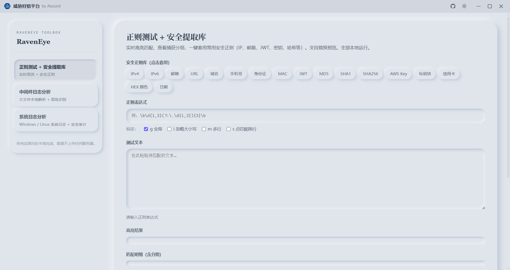
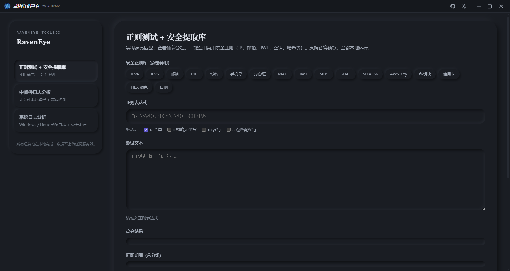
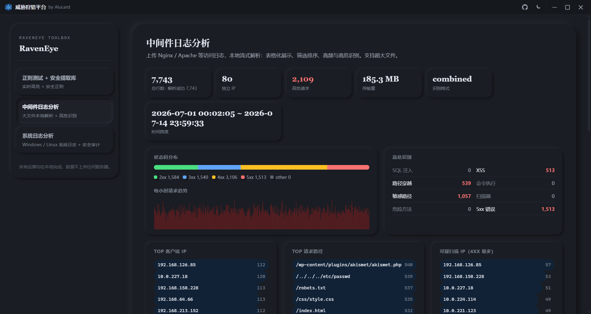
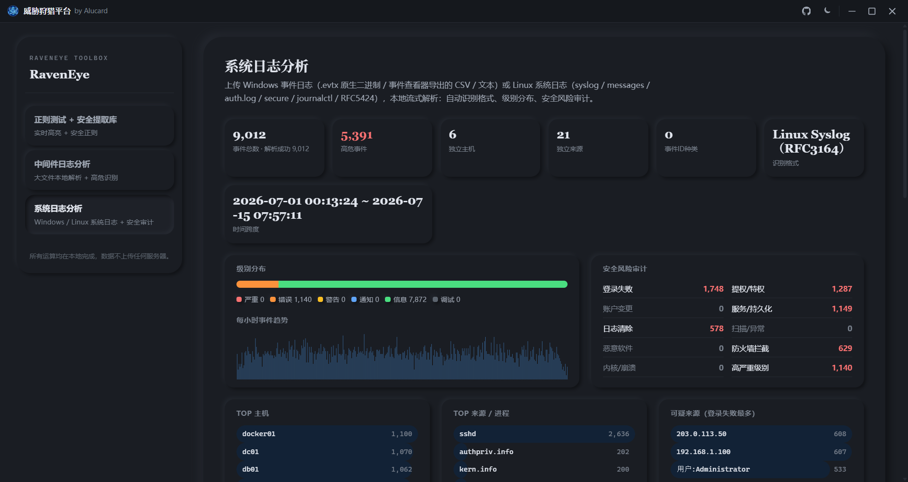

# RavenEye · 威胁狩猎平台

<p align="center">
  
</p>

<p align="center">
  <strong>本地优先 · 三合一安全分析工具箱</strong>
  <br>
  正则测试 · 中间件日志分析 · 系统日志分析
  <br>
  所有运算均在本地完成，数据不上传任何服务器
</p>

<p align="center">
  <a href="https://github.com/Alucard-Hellsings/RavenEye/releases"></a>
  <a href="https://github.com/Alucard-Hellsings/RavenEye/releases"></a>
  <a href="https://www.electronjs.org/"></a>
</p>

<p align="center">
  <a href="#-功能">功能</a> ·
  <a href="#-快速开始">快速开始</a> ·
  <a href="#-从源码构建">从源码构建</a> ·
  <a href="#-项目结构">项目结构</a>
</p>

---

## 截图

| 浅色模式 | 深色模式 |
|----------|----------|
|  |  |

| 中间件日志分析 | 系统日志分析 |
|----------------|--------------|
|  |  |

---

## 功能

| 模块 | 描述 |
|------|------|
| **正则测试 + 安全提取库** | 内置 JWT、密钥、哈希等常见安全模式提取，支持在线匹配与测试 |
| **中间件日志分析** | Nginx / Apache / IIS 大文件离线解析，高危请求高亮，攻击特征自动提取 |
| **系统日志分析** | Windows EVTX、Linux Syslog、CSV 等格式离线解析，异常行为识别 |

### 特性

- **纯本地** — Web Worker 流式解析，数据不离机
- **超大文件** — 基于 ArrayBuffer 竞技场，支持千万级日志行
- **双主题** — 浅色 / 深色一键切换，新拟态视觉风格
- **无框窗口** — 自定义标题栏，工业级交互体验

---

## 快速开始

### 下载

从 [Releases](https://github.com/Alucard-Hellsings/RavenEye/releases) 下载 `RavenEye Setup 1.0.0.exe`，双击安装。

### 从源码构建

```bash
# 克隆
git clone https://github.com/Alucard-Hellsings/RavenEye.git
cd RavenEye

# 安装依赖
npm install

# 开发模式
npm run dev

# 打包
npm run build
```

### 环境

- Node.js >= 18
- npm >= 9

---

## 项目结构

```
RavenEye/
├── main.js              # Electron 主进程
├── preload.js           # IPC 桥接
├── index.html           # 主界面
├── package.json
├── icon.png
├── css/
│   ├── variables.css    # 新拟态色彩变量
│   ├── layout.css       # 全局布局
│   ├── components.css   # 标题栏、弹窗
│   ├── tools.css        # 正则工具
│   ├── logs.css         # 中间件日志
│   ├── syslogs.css      # 系统日志
│   ├── scrollbar.css    # 滚动条
│   ├── reset.css        # 重置
│   └── animations.css   # 动画
├── js/
│   ├── theme.js         # 主题系统
│   ├── tools.js         # 正则 + 安全提取
│   ├── logs.js          # 中间件日志视图
│   ├── log-worker.js    # 中间件日志 Worker
│   ├── syslogs.js       # 系统日志视图
│   ├── syslog-worker.js # 系统日志 Worker
│   ├── confirm.js       # 退出确认
│   └── cp-style.js      # 动态样式
└── release/             # 打包产物
```

---

## 技术栈

| 层 | 选型 |
|----|------|
| 桌面框架 | Electron |
| 前端 | 原生 HTML / CSS / JavaScript |
| 数据解析 | Web Worker + ArrayBuffer 竞技场 |
| 样式系统 | 新拟态（Neumorphism） |
| 打包 | electron-builder + NSIS |

---

<p align="center">
  <b>联系我们</b> · QQ：2061932215
  <br>
  <sub>MIT License © 2026 Alucard</sub>
</p>
